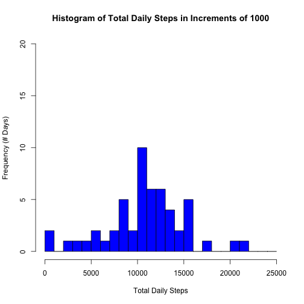

```r
library(knitr)
opts_chunk$set(echo=T, results = 'asis')
```

This markdown file is an analysis of activity data from the fitness tool "Jawbone Up" from an individual.  The analysis was performed as part of course hosted by John Hopkins Univeristy on the Coursera website (coursera.org) entitled *Reproducible Research*.  It is assignment #1 of this course.  The data were downloaded from the course website at located [here](https://d396qusza40orc.cloudfront.net/repdata%2Fdata%2Factivity.zip) on 14 July, 2014.

The assignment asks a series of questions about the raw data that are answered invididually in separate chunks of code in this R markdown file.  The raw data are activity readings from an indiidual wearing a Jawbone Up self-monitoring activity device.  The data were recorded over a 61 day period from the individual during the months of October and November 2012.  The data conist of 3 variables, the steps taken (steps), the date the activity occured on (date), and the interval in which the activity took place (interval; intervals are 5 minutes apart from one another over the course of the day, so there are 288 recordings per day) 

### Q1. What are the mean and median total number of steps taken per day? (ignoring missing values)
The following code generates the mean and median values for the total steps taken on each day of the 'activity.csv' dataset located at the url above.  The calculated mean # of steps per day is 10,766.19, while the median # of steps per day is 10,765.


```r
# loads the activity.csv data from working directory
directory = getwd()
directory = paste(directory,'/activity.csv', sep='')
raw.data = read.csv(directory)
# convert data to remove NA values
data = droplevels(subset(raw.data, subset = !is.na(raw.data[,1])))
# calculate mean & median steps per day
total.daily.steps = tapply(data$steps, data$date, sum, simplify = T)
mean = mean(total.daily.steps)
median = median(total.daily.steps)
#plot histogram 
bins = seq(0,25000, 1000)
hist(total.daily.steps, breaks = bins, ylim = c(0,20), main = 'Histogram of Total Daily Steps in Increments of 1000', xlab = 'Total Daily Steps', ylab = 'Frequency (# Days)', col = 'blue')
```

 

### Q2. What is the average daily activity pattern?
This code calculates the total steps taken on each time interval and divides this value by the total days containing non-NA values (53 of 61 recorded days) to get the average # of steps taken for each interval across all days.  The result is plotted as a time series chart.  From the chart, and calculated from the variable *max.interval* below, the interval with the most activity across all the days of the dataset occurs at 835, or 8:35am.

```r
mean.interval.steps = tapply(data$steps, data$interval, sum, simplify = T) / length(unique(data$date))
max.interval = unique(data$interval)[which.max(mean.interval.steps)]
print(paste('The interval with maximum steps taken is', max.interval))
```

[1] "The interval with maximum steps taken is 835"

```r
plot(unique(data$interval), mean.interval.steps, ylab = 'Average Steps at Given Interval', xlab = '5m Interval Number', main = 'Average Step Counts at Each 5m Time Interval Across All Days',pch = 18, col = 'blue')
```

 

### Q3. Inputting missing values: What effect do they have on the data?
This code compares the sizes of the dataframes to determine the number of NA values.  Then, the part of the dataframe that has NA values is isolated, filled in using the average # of steps (over 53 days) from the complete dataset for each interval, before merging them back into one dataset.  From these data, the mean # of total daily steps is now 10,766.19 (unchanged) and the median is now 10,766.19, or identical to the mean (which makes sense given the chosen method for calculating the missing values).  Finally, the new histogram plot is generated.  As expected, using the average from the near-complete dataset to fill in values for the missing data "middle-skews" the data; i.e. the influence of outliers are reduced, and the distrbution appears more Gaussian because the newly generated values are closer to the original mean of the data.  This is why the "means of means" distribution (e.g. from experimental data) is almost always Gaussian in nature.

```r
missing.values = dim(raw.data)[1] - dim(data)[1]
print(paste('The # of missing values is', missing.values))
```

[1] "The # of missing values is 2304"

```r
# generate average values to fill in missing data
data.na = droplevels(subset(raw.data, subset = is.na(raw.data[,1])))
data.na$steps = mean.interval.steps
data.complete = rbind(data.na, data)

# claculate new total values based on fully complete, simulated data
total.daily.steps = tapply(data.complete$steps, data.complete$date, sum, simplify = T)
mean = mean(total.daily.steps)
median = median(total.daily.steps)
# plot histogram 
bins = seq(0, 25000, 1000)
hist(total.daily.steps, breaks = bins, ylim = c(0,20), main = 'Histogram of Total Daily Steps in Increments of 1000\nAfter Filling in Missing Values', xlab = 'Total Daily Steps', ylab = 'Frequency (# Days)', col = 'blue')
```

 

### Q4. Are there differences in activity patterns between weekdays and weekends?
In this final section, the code here takes advantage of the weekdays() funciton to determine the day of week for each date in the dataset.  From these data, a factor variable consisting of 'weekdays' and 'weekends' is generated to separate the data into individual datasets and compare the time series of plots.  From the plots, it is obvious (and expected), that this individual is more active throughout the day on weekends versus weekdays, but also has a fairly similar awake and sleep schedule, rising slightly later on weekends and staying up a bit later as well.  It is likely that this person has a desk job and not a "blue collar" job consisting of heavy physical labor.

```r
data.complete$date = as.Date(data.complete$date)
days = weekdays(data.complete$date)
# create a factor for the weekdays vs weekends in original dateset
days[days == 'Saturday'] = 'weekend'
days[days == 'Sunday'] = 'weekend'
days[days != 'weekend'] = 'weekday'
days = as.factor(days)
data.complete = cbind(data.complete, days)

# subset the data to separate data frames and calculagte the average interval values for each dataframe
data.complete1 = subset(data.complete, subset = data.complete$days == 'weekday')
data.complete2 = subset(data.complete, subset = data.complete$days == 'weekend')
mean.weekdays = tapply(data.complete1$steps, data.complete1$interval, sum, simplify = T) / length(unique(data.complete1$date))
mean.weekends = tapply(data.complete2$steps, data.complete2$interval, sum, simplify = T) / length(unique(data.complete2$date))

# generate plots
par(mfrow = c(2,1))
par(mar = c(2,2,0,0), oma = c(5,5,2.75,0.5))
plot(unique(data$interval), mean.weekdays, main = , pch = 18, col = 'blue', ann = F, cex.axis = 0.75)
plot(unique(data$interval), mean.weekends, pch = 18, col = 'blue', ann = F, cex.axis = 0.75)
mtext('Interval Number', side = 1, outer = T)
mtext('Mean # Steps', side = 2, outer = T)
mtext('Mean Step Counts at Each 5m Time Interval Across\nWeekdays (top) & Weekends (bottom)', outer = T, side = 3, cex = 1.25)
```

 

